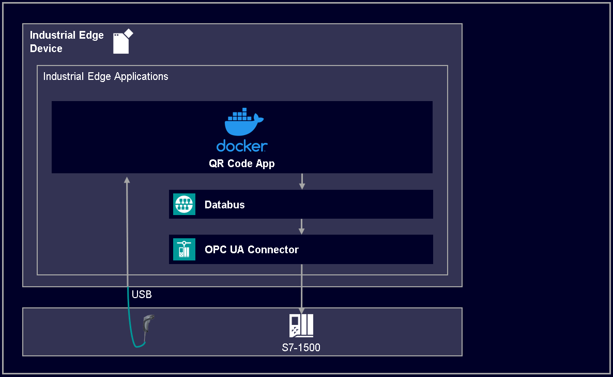

# Connecting USB QR Code Scanner

Connecting an USB based QR code scanner to an Industrial Edge Device.

- [Connecting USB QR Code Scanner](#connecting-usb-qr-code-scanner)
  - [Description](#description)
    - [Overview](#overview)
    - [General Task](#general-task)
  - [Requirements](#requirements)
    - [Used Components](#used-components)
    - [TIA Project](#tia-project)
    - [Configuring PLC Connection](#configuring-plc-connection)
  - [Installation](#installation)
  - [Usage](#usage)
  - [Implementation](#implementation)
  - [Documentation](#documentation)
  - [Contribution](#contribution)
  - [License and Legal Information](#license-and-legal-information)
  - [Disclaimer](#disclaimer)

## Description

### Overview

This application examples shows how to connect a QR code scanner via USB to the Industrial Edge Device. The scanned QR code will be sent to a PLC and displayed in an HMI Panel.

### General Task

The application reads the QR code provided by the scanner and publishes it on the Databus to the topic corresponding to the OPC UA Connector, which sends the data to the PLC. This topic needs to be created in the Databus in advance.
The scanner type, PLC tag, Databus topic as well as Databus credentials can be configured via an external configuration file.

## Requirements

### Used Components

- Industrial Edge App Publisher V1.12.7
- Docker Engine 24.0.6
- Docker Compose V2.21.0
- Common Connector Configurator V1.9.1-1
- Databus V2.3.1-2
- Databus Configurator V2.0.0-5
- Industrial Edge Device V1.12.0-10
- IE App Configuration Service V1.3.2
- OPC UA Connector V2.1.0-0
- QR Code Scanner: SIMATIC MV320
- TIA Portal V18 (V16 minimum)
- PLC: CPU 1518 FW 2.8.3

### TIA Project

The used TIA Portal project can be found in the [miscellaneous repository](https://github.com/industrial-edge/miscellaneous) in the tank application folder and is also used for several further application examples:

- [Tia Tank Application](https://github.com/industrial-edge/miscellaneous/tree/main/tank%20application)
  
### Configuring PLC Connection

Further information about how to configure the OPC UA Connector to write data to the PLC can be found in the [docs](docs/PLC_connection.md) section.

- [Configure Databus](docs/PLC_connection.md#configuring-databus)
- [Configure OPC UA Connector](docs/PLC_connection.md#configuring-opc-ua-connector)

## Installation

You can find further information about the following steps in the [docs](./docs/Installation.md)

- [Configure QR Code Scanner](docs/Installation.md#configure-qr-code-scanner)
- [Build application](docs/Installation.md#build-application)
- [Upload scanner app to the Industrial Edge Management](docs/Installation.md#upload-scanner-app-to-the-industrial-edge-management)
- [Configuring Application](docs/Installation.md#configuring-application)
- [Create & Deploy of QR code scanner demo](docs/Installation.md#create--deploy-configuration-file)

## Usage

Plug your SIMATIC MV320 QR code scanner (or any other USB Scanner) to one of the USB ports of your Industrial Edge Device.

Go to the TIA Portal Project, start the HMI Runtime and scan any available QR code (e.g., the following QR code). A pop up will appear with the content of the scanned code.

You can also open the GBD data block in the TIA Portal and check the content of the APP_QRCode variable in the appSignals structure.

## Implementation
The access to the USB based QR code scanner inside the application as well as further details about the source code can be found in the [implementation](docs/Implementation.md) section.

- [Accessing QR Code Scanner](docs/Implementation.md#accessing-qr-code-scanner) inside the application
- [Publishing QR Code](docs/Implementation.md#publishing-code-to-databus) to the Databus

## Documentation
 
- You can find further documentation and help in the following links
  - [Industrial Edge Hub](https://iehub.eu1.edge.siemens.cloud/#/documentation)
  - [Industrial Edge Forum](https://forum.mendix.com/link/space/industrial-edge)
  - [Industrial Edge landing page](https://new.siemens.com/global/en/products/automation/topic-areas/industrial-edge/simatic-edge.html)
  - [Industrial Edge GitHub page](https://github.com/industrial-edge)
  - [Industrial Edge documentation page](https://docs.eu1.edge.siemens.cloud/index.html)
  
## Contribution

Thank you for your interest in contributing. Anybody is free to report bugs, unclear documentation, and other problems regarding this repository in the Issues section.
Additionally everybody is free to propose any changes to this repository using Pull Requests.

If you haven't previously signed the [Siemens Contributor License Agreement](https://cla-assistant.io/industrial-edge/) (CLA), the system will automatically prompt you to do so when you submit your Pull Request. This can be conveniently done through the CLA Assistant's online platform. Once the CLA is signed, your Pull Request will automatically be cleared and made ready for merging if all other test stages succeed.

## License and Legal Information

Please read the [Legal information](LICENSE.txt).

## Disclaimer

IMPORTANT - PLEASE READ CAREFULLY:

This documentation describes how you can download and set up containers which consist of or contain third-party software. By following this documentation you agree that using such third-party software is done at your own discretion and risk. No advice or information, whether oral or written, obtained by you from us or from this documentation shall create any warranty for the third-party software. Additionally, by following these descriptions or using the contents of this documentation, you agree that you are responsible for complying with all third party licenses applicable to such third-party software. All product names, logos, and brands are property of their respective owners. All third-party company, product and service names used in this documentation are for identification purposes only. Use of these names, logos, and brands does not imply endorsement.
