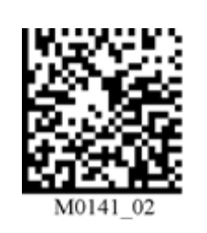
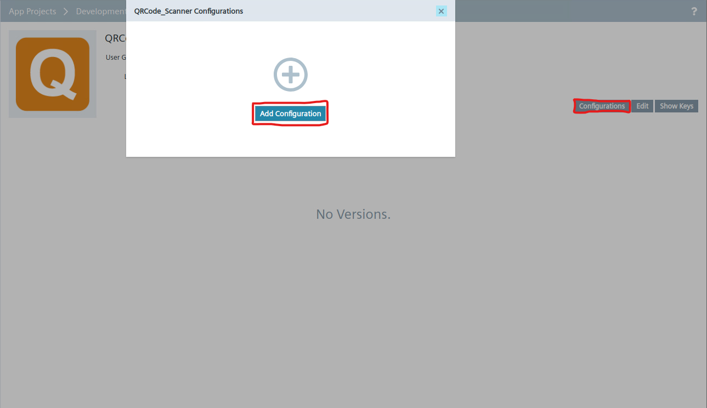
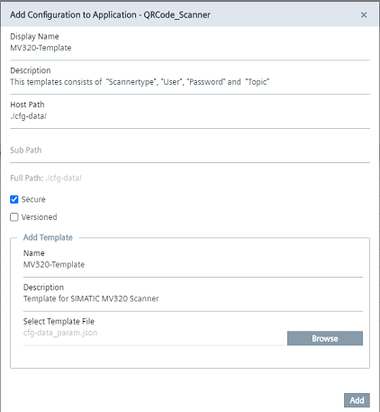
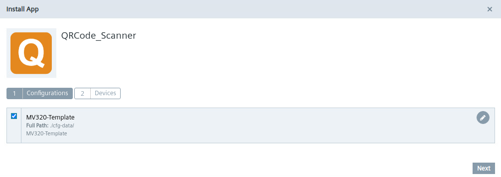
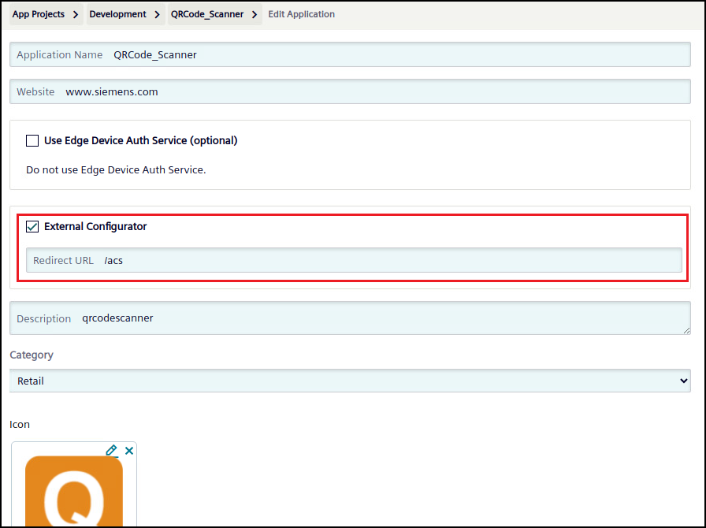
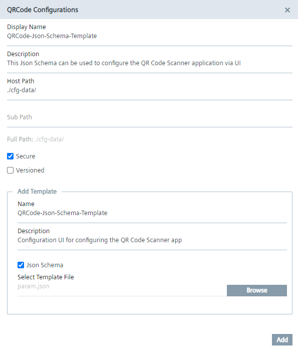
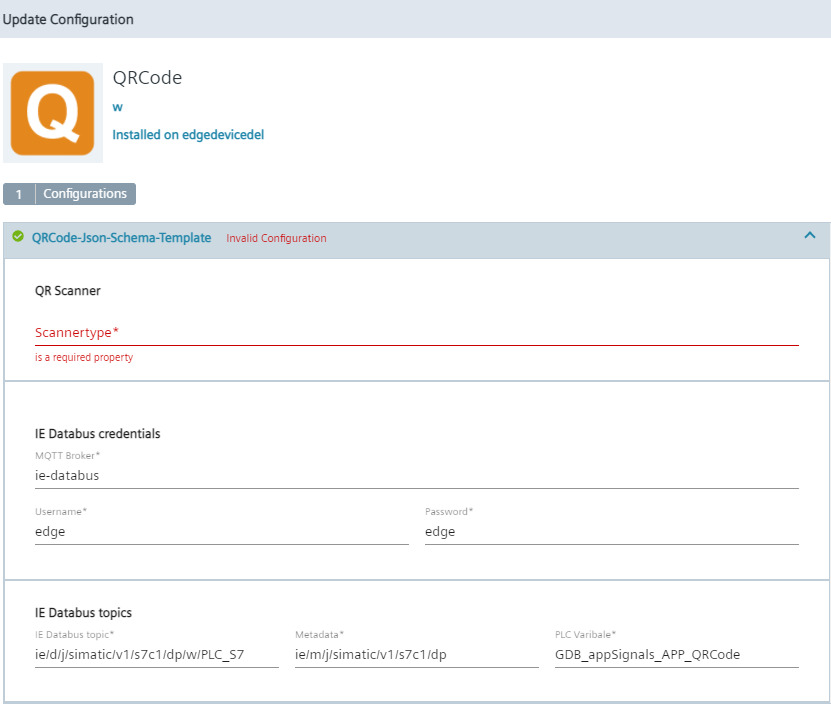

# Installation

- [Installation](#installation)
  - [Configure QR Code Scanner](#configure-qr-code-scanner)
  - [Build Application](#build-application)
    - [Download Repository](#download-repository)
    - [Build docker image](#build-docker-image)
  - [Upload Scanner App to the Industrial Edge Management](#upload-scanner-app-to-the-industrial-edge-management)
    - [Connect your Industrial Edge App Publisher](#connect-your-industrial-edge-app-publisher)
    - [Upload Scanner App using the Industrial Edge App Publisher](#upload-scanner-app-using-the-industrial-edge-app-publisher)
  - [Configuring Application](#configuring-application)
  - [Create & Deploy Configuration File](#create--deploy-configuration-file)
    - [Configuration via Template File](#configuration-via-template-file)
    - [Configuration via JSON Schema UI](#configuration-via-json-schema-ui)
  
## Configure QR Code Scanner

The Siemens MV 320 QR code scanner can be configured by scanning specific QR codes. This application is designed for checking for the **enter** character as suffix of the scanned code. To configure the scanner to add this suffix after each scanned code scan the following QR code. 

After detecting the suffix character the scanned code is published to the Databus and sent to the PLC using the OPC UA Connector.

**Scan to configure the Enter suffix:**



## Build Application

### Download Repository

Download or clone the repository source code to your workstation.  


* Trough terminal:
```bash
git clone https://github.com/industrial-edge/qr-code-scanner.git
```

* Trough VSCode:  
<kbd>CTRL</kbd>+<kbd>&uarr; SHIFT</kbd>+<kbd>P</kbd> or <kbd>F1</kbd> to open VSCode's command pallette and type `git clone`:


### Build Docker Image

- Navigate into `src` and find the file named `Dockerfile.example`. The `Dockerfile.example` is an example Dockerfile that can be used to build the docker image(s) of the service(s) that runs in this application example. If you choose to use this example file, rename it to `Dockerfile` before proceeding
- Open a console in the root folder (where the `docker-compose` file is)
- Use the `docker compose build` (replaces the older `docker-compose build`) command to build the docker image of the service which is specified in the docker-compose.yml file.
- These Docker images can now be used to build your app with the Industrial Edge App Publisher
- `docker images` can be used to check for the images

## Upload Scanner App to the Industrial Edge Management

Please find below a short description how to publish your application to your IEM.

For more detailed information please see the section for [uploading apps to the IEM](https://github.com/industrial-edge/upload-app-to-iem).

### Connect your Industrial Edge App Publisher

- Connect your Industrial Edge App Publisher to your Docker engine
- Connect your Industrial Edge App Publisher to your Industrial Edge Management System

### Upload Scanner App using the Industrial Edge App Publisher

- Click on "Create Project" in the App Project region (you will be redirected to the IEM)
- Create a new project with "Create Project" in the top right corner or use an existing project
- Create an application
- Go back to the Industrial Edge Publisher, refresh the app projects, select the application and add a new app version
- Import the [docker-compose](../docker-compose.yml) file using the "Import YAML" button
- The warning `Build (services >> scanner-service) is not supported` can be ignored
- "Start Upload" to transfer the app to Industrial Edge Management
- Further information about using the Industrial Edge App Publisher can be found in the [IE Hub](https://iehub.eu1.edge.siemens.cloud/documents/appPublisher/en/start.html)

## Configuring Application

You can find the configuration file [param.json](../cfg-data/param.json) in cfg-data folder. This configuration file can be used to adjust several parameters of this application. You can see the structure of the file in the following example configuration:

**param.json:**

```json
    {
        "Scannertype": "Siemens AG MV320", 
        "Mqtt_Broker_Server": "ie-databus",
        "User": "edge",
        "Password": "edge",
        "Metadata": "ie/m/j/simatic/v1/opcuac1/dp",
        "Topic": "ie/d/j/simatic/v1/opcuac1/dp/w/PLC_OPC",
        "Variable": "GDB.appSignals.APP_QRCode"
    }
```

- **Scannertype**: Name of your scanner, which is used in the Linux device tree
- **Mqtt_Broker_Server**: Service name of the Databus
- **User**: User of the  OPC UA Connector databus topic
- **Password**: Password of the  OPC UA Connector databus topic
- **Metadata**: Topic of the metadata of the used connector
- **Topic**: The connection name of the OPC UA Connector connection, which is used to send the scanned code to the PLC. The topic consists of the default OPC UA Connector topic `ie/d/j/simatic/v1/opcuac1/dp/w` and the *connection name* configured in the OPC UA Connector Configurator (Here `PLC_OPC`)
- **Variable**: The name of the variable, which is configured in the OPC UA Connector

Adjust the configuration file depending on your needs.

## Create & Deploy Configuration File

The system offers several possibilities configuring your application. The following steps describes two available options:

- Configuring via [Template File](#configuration-via-template-file)
- Configuring via [JSON Schema UI](#configuration-via-json-schema-ui)

### Configuration via Template File

Once you have successfully uploaded the QR code scanner application to your IEM you need to add the [configuration file](../cfg-data/param.json) to your application. You can either choose between version and non versioned configuration files. The non version configuration file will be described in the next steps.
Go to "App Projects", select your project and open your QR code scanner application. Here you can create a new configuration file.

**Add Configuration:**

Click on "Configurations" and in the upcoming window "Add Configuration".


**Configure Configuration:**



Make sure to use this [configuration file](../cfg-data/param.json).

**Deploy Application with Configuration File:**

During the deploying process of the application you need to select the configuration file you just created.



### Configuration via JSON Schema UI
Using the JSON schema option the application can be configured via a graphical UI during the download of the application to the edge device or when updating the configuration. All needed parameters can be configured here. You need to use this [configuration file](../cfg-data/json_schema/param.json) for this method.

**Adjust App Settings:**

Before uploading the JSON schema you need to enable an external configurator first:



**Add JSON Schema:**

Go back to the overview of the app, click on "Configurations" and in the upcoming window "Add Configuration".



Make sure to use the correct [configuration file](../cfg-data/json_schema/param.json).

**Configure Application:** 

As soon as you deploy the application (or if updating the configuration) you can now adjust the configuration:



Before clicking Next make sure to have checked the checkmark at the top left hand corner.

**Additional Information:**

Further information about creating your own JSON Schema UI can be found:

- https://jsonforms.io/
- https://jsonforms-editor.netlify.app/