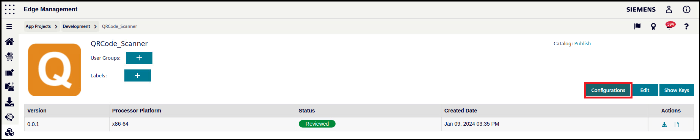
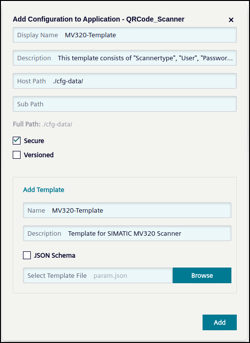
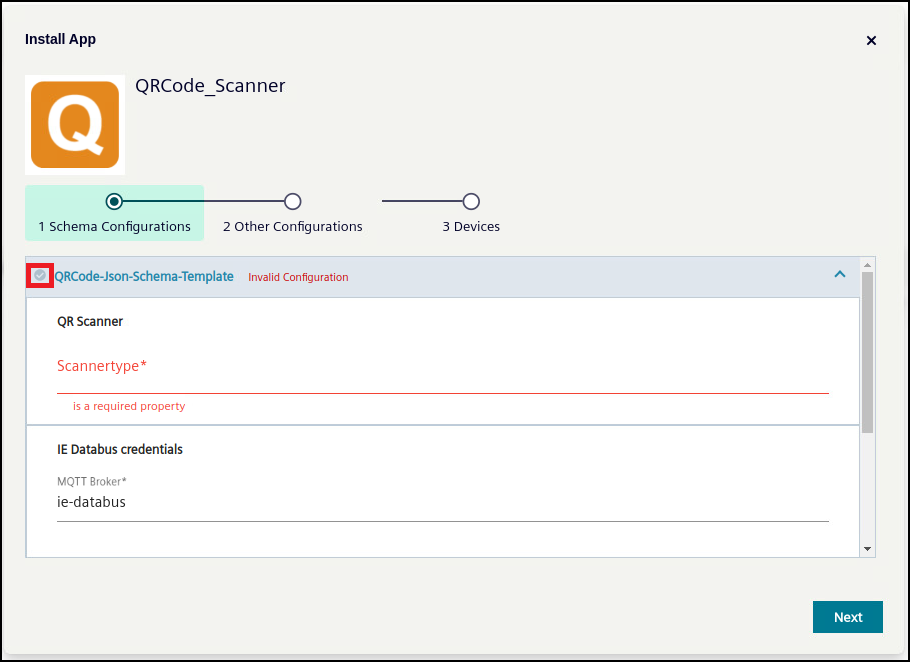
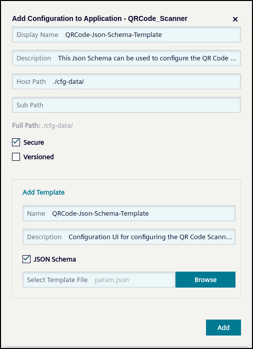

# Installation

- [Installation](#installation)
  - [Configure QR Code Scanner](#configure-qr-code-scanner)
  - [Build application](#build-application)
    - [Cloning image](#cloning-image)
    - [Build docker image](#build-docker-image)
  - [Upload Scanner App to the Industrial Edge Management](#upload-scanner-app-to-the-industrial-edge-management)
    - [Connect your Industrial Edge App Publisher](#connect-your-industrial-edge-app-publisher)
    - [Upload Scanner App using the Industrial Edge App Publisher](#upload-scanner-app-using-the-industrial-edge-app-publisher)
  - [Configuring application](#configuring-application)
  - [Create & Deploy configuration file](#create--deploy-configuration-file)
    - [Configuration via template file](#configuration-via-template-file)
    - [Configuration via JSON Schema UI](#configuration-via-json-schema-ui)
  
## Configure QR Code Scanner

The application is designed for checking for the **enter** character as suffix of the scanned code. The scanner can be configured to add this suffix after each scanned code by scanning the following QR Code. After detecting the suffix character the scanned code is published to the IE Databus and sent to the PLC using the S7 Connector.

**Scan to configure the enter suffix:**


## Build application

### Cloning image

- Clone or Download the source code to your engineering VM

### Build docker image

- Open console in the source code folder
- Use command `docker-compose build` to create the docker image.
- This docker image can now be used to build you app with the Industrial Edge App Publisher
- *docker images | grep scannerapp* can be used to check for the images
- You should get a result similar to this:


## Upload Scanner App to the Industrial Edge Management

Please find below a short description how to publish your application in your IEM.

For more detailed information please see the section for [uploading apps to the IEM](https://github.com/industrial-edge/upload-app-to-iem).

### Connect your Industrial Edge App Publisher

- Connect your Industrial Edge App Publisher to your docker engine
- Connect your Industrial Edge App Publisher to your Industrial Edge Management System

### Upload Scanner App using the Industrial Edge App Publisher

- Create a new application using the Industrial Publisher
- Add a app new version
- Import the [docker-compose](../docker-compose.yml) file using the **Import YAML** button
- The warning `Build (sevices >> scanner-service) is not supported` can be ignored
- **Start Upload** to transfer the app to Industrial Edge Managment
- Further information about using the Industrial Edge App Publisher can be found in the [IE Hub](https://iehub.eu1.edge.siemens.cloud/documents/appPublisher/en/start.html)

## Configuring application

You can find the configuration file ["param.json"](../cfg-data/param.json) in cfg-data folder. This configuration file can be used adjust several parameters of this application. You can see the structure of the file in the following example configuration:

**param.json:**

```json
    {
        "Scannertype": "Siemens AG MV320", 
        "Mqtt_Broker_Server": "ie-databus",
        "User": "edge",
        "Password": "edge",
        "Metadata": "ie/m/j/simatic/v1/s7c1/dp",
        "Topic": "ie/d/j/simatic/v1/s7c1/dp/w/PLC_S7",
        "Variable": "GDB_appSignals_APP_QRCode"
    }
```

- **Scannertype**: Name of your scanner, which is used in the Linux device tree
- **Mqtt_Broker_Server**: Service name of the IE Databus
- **User**: User of the  S7 Connector databus topic
- **Password**: Password of the  S7 Connector databus topic
- **Metadata**: Topic of the metadata of the used connector
- **Topic**: The connection name of the S7 Connector connection, which is used to send the scanned code to the PLC. The topic consists of the default S7 Connector topic `ie/d/j/simatic/v1/s7c1/dp/w` and the *connection name* configured in the S7 Connector Configurator (Here `PLC_S7`)
- **Variable**: The name of the variable, which is configured in the S7 Connector

Adjust the configuration file depending on your needs.

## Create & Deploy configuration file

The system offers several possibilities configuring your application. The following steps describes two available options:

- Configuring via [Template File](#configuration-via-template-file)
- Configuring via [JSON Schema UI](#configuration-via-json-schema-ui)

### Configuration via template file

Once you have successfully uploaded the QR Code Scanner application to your IEM you need to add the [configuration file](../cfg-data/param.json) to your application. You can either choose between version and non versioned configuration files. The non version configuration file will be described in the next steps.
Go to **Applications/ My Projects** and open the QR Code Scanner application. Here you can create a new configuration file.

**Add Configuration:**


**Configure** **Configuration**



**Deploy application with configuration file:**

During the deploying process of the application you need to select the configuration file, if needed you can adapt the configuration file before deploying.

**Deploy Application:**


### Configuration via JSON Schema UI

Using the JSON Schema option the application can be configured via graphical UI during downloading of the application. All needed parameters can be configured in the UI:

**Configure application:**



**Add Configuration:**

Before [uploading](#upload-scanner-app-to-the-industrial-edge-managment) the application with the Industrial Edge Publisher you can add the JSON Schema via the **"+Configurations"** button. Add a new configuration (in the IE Publisher), select the JSON Schema option and upload the [JSON Schema file](../cfg-data/json_schema/).

**Add JSON Schema:**



During downloading of the QR Code Scanner application you can now select the added JSON Schema and configure the application via the configuration UI.

**Additional information:**

Further information about creating your own JSON Schema UI can be found:

- https://jsonforms.io/
- https://jsonforms-editor.netlify.app/