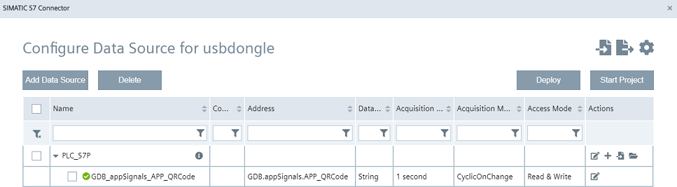

# Configure S7 Connection

After the scanning event the code should be sent to the PLC using the S7 Connector. For doing this the S7 Connector as well as the IE Databus needs to be configured properly.

- [Configure S7 Connection](#configure-s7-connection)
  - [Configuring IE Databus](#configuring-ie-databus)
  - [Configuring S7 Connector](#configuring-s7-connector)

## Configuring IE Databus

Create the topic in your IE Databus, which allows you to write to PLCs.
The corresponding IE Databus topic for writing to your PLC looks like this: ie/d/j/simatic/v1/s7c1/dp/w/#
Additionally the meta data topic ie/m/# needs to be configured, which is required for properly configure the MQTT connection inside of the application.  
Using the wildcard sign **#** you have access to all configured connections.

## Configuring S7 Connector

In the TIA Portal project the variable **APP_QRCode** in the Datablock **GDB** had been created for receiving the scanned code. Create a new connection - either OPC UA or S7 for 1500 PLCs - and add the GDB_APP_QRCode to the connection.

