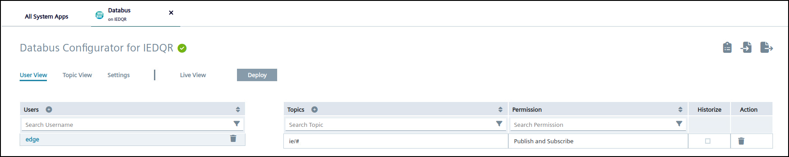
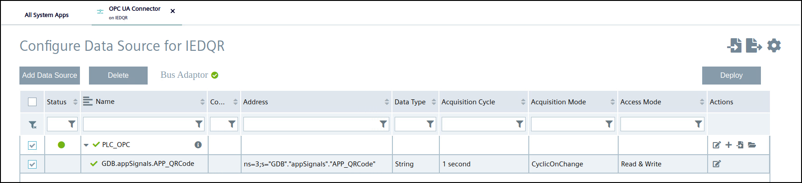

# Configure OPC UA Connection

After the scanning event the code should be sent to the PLC using the OPC UA Connector. For doing this the OPC UA Connector as well as the Databus needs to be configured properly.

- [Configure OPC UA Connection](#configure-opc-ua-connection)
  - [Configuring Databus](#configuring-databus)
  - [Configuring OPC UA Connector](#configuring-opc-ua-connector)

## Configuring Databus

Create the topic in your Databus, which allows you to write to PLCs.
The corresponding Databus topic for writing to your PLC looks like this: ie/d/j/simatic/v1/opcuac1/dp/w/#
Additionally the meta data topic ie/m/# needs to be configured, which is required for properly configure the MQTT connection inside of the application.  
Using the wildcard sign **#** you have access to all configured connections.

## Configuring OPC UA Connector

In the TIA Portal project the variable **APP_QRCode** in the Datablock **GDB** had been created for receiving the scanned code. Create a new connection - OPC UA for 1500 PLCs - and add the GDB_APP_QRCode to the connection.

